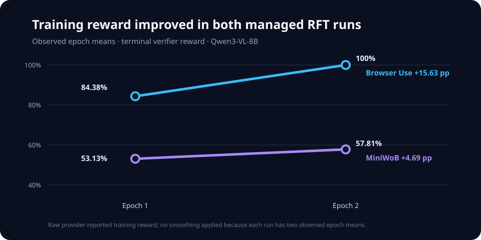

# Browser policy RFT

An end-to-end flywheel for training small vision-language models as browser
automation policies:

`Fireworks model -> Eval Protocol agent -> constrained browser tools -> task environment -> terminal reward`

Browser Use Cloud and MiniWoB++ are interchangeable environment backends behind
the same policy and evaluator boundary. A reviewed TOML defines each dataset,
model, rollout budget, training run, and evaluation.

## What it does

- Runs managed RLVR for Qwen3-VL-8B with executable browser actions.
- Preserves observations, actions, tool results, usage, and final outcomes.
- Rejects unfinished, malformed, leaked, and oversized trajectories.
- Freezes train, development, and held-out task families before training.
- Compares base and tuned policies under identical serving and rollout budgets.
- Tears down temporary deployments after evaluation.

## Measured experiment signals

Across 128 MiniWoB training rollouts, mean reward moved from `53.13%` to
`57.81%`. The gain came from `form-sequence-3` (`37.5% -> 62.5%`) and
`use-autocomplete` (`+12.5` percentage points). On matched held-out execution,
the tuned policy reduced repeated-action loops from `26` to `17` and mean
rollout time from `17.415s` to `17.274s`.

**How to read it?** `form sequence` asks to interpret a multi-step instruction with UI controls. `use-autocomplete` asks the SLM to enter an item satisfying supplied prefix and suffix constraints.  Trajectory admission keeps only complete observation-action-result histories with a valid terminal reward and explicit `finish`, so incomplete or inconsistent rollouts cannot silently become
training data.

The preprocessing path materialized 111 complete execution-backed trajectories
while quarantining 17 incomplete trajectories. 

The resulting pipeline is resume-safe and reproducible: managed training,
execution-backed trajectory admission, native task evaluation, family-level
splits, matched base-versus-tuned evaluation, and deployment cleanup all share
one declarative CLI surface.

## Project map

- `configs/rft/` — executable run contracts.
- `evaluator/` — hosted evaluator, browser tools, tasks, and reward contracts.
- `src/browseruse_ft/` — dataset, preprocessing, training, and evaluation CLI.
- `scripts/` — reproducible task generation and environment setup.
- `notebooks/data_explore.py` — Marimo data inspection surface.

See [SETUP.md](SETUP.md) for installation, configuration, training, evaluation,
and local proof commands.
